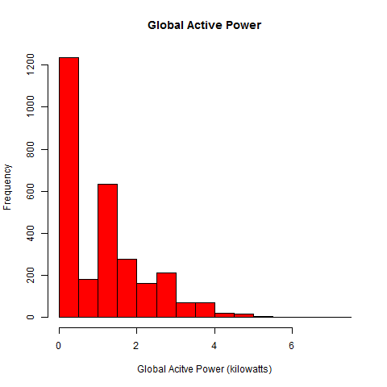
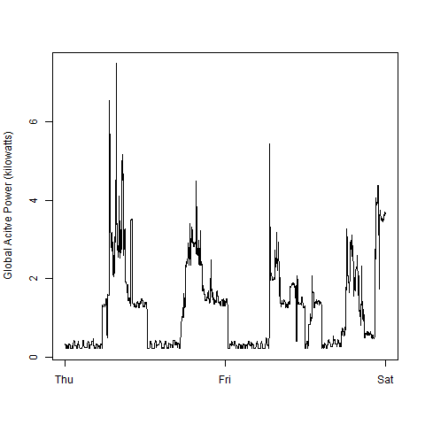
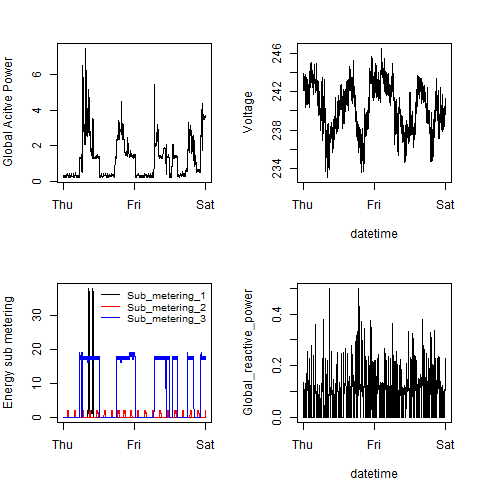

## Answer 

The four plots are here. 


### Plot 1


 
   
```
####  Plot 1
      png(filename = "./data/plot1.png",width = 480, height = 480, units = "px",bg="white" )
      hist(raw$Global_active_power,main=NA,col="red",
           xlab="Global Acitve Power (kilowatts)",
           #xlim=range(2:6)
           )
      title("Global Active Power")
      dev.off()
```

### Plot 2

 

```
####  Plot 2
      png(filename = "./data/plot2.png",width = 480, height = 480, units = "px",bg="white" )
      plot(raw$DateTime,raw$Global_active_power,type="n",
           ylab="Global Acitve Power (kilowatts)",
           xlab=NA)
      lines(raw$DateTime,raw$Global_active_power)
      dev.off()
```
### Plot 3

 

```
####  Plot 3
      png(filename = "./data/plot3.png",width = 480, height = 480, units = "px",bg="white" )
      plot(raw$DateTime,raw$Sub_metering_1,type="n",
           ylab="Energy sub metering",
           xlab=NA)
      lines(raw$DateTime,raw$Sub_metering_1)
      lines(raw$DateTime,raw$Sub_metering_2,col='red')
      lines(raw$DateTime,raw$Sub_metering_3,col='blue')
      legend("topright",lty = 1,lwd=1.7,col=c("black","red","blue"),legend=c("Sub_metering_1","Sub_metering_2","Sub_metering_3"))
      dev.off()
```

### Plot 4

 

```####  Plot 4
      png(filename = "./data/plot4.png",width = 480, height = 480, units = "px",bg="white",res=72 )

      par(mfrow=c(2,2),mar= c(3, 4, 3, 2) ,cex=1,cex.lab=1)

      plot(raw$DateTime,raw$Global_active_power,type="l", ylab="Global Acitve Power", xlab=NA)

      plot(raw$DateTime,raw$Voltage,type="l", ylab="Voltage", xlab="datetime")

      plot(raw$DateTime,raw$Sub_metering_1,type="n",
           ylab="Energy sub metering",
           xlab=NA)
      lines(raw$DateTime,raw$Sub_metering_1)
      lines(raw$DateTime,raw$Sub_metering_2,col='red')
      lines(raw$DateTime,raw$Sub_metering_3,col='blue')
      legend("topright",lty = 1,lwd=1,bty="n",cex=.8,col=c("black","red","blue"),legend=c("Sub_metering_1","Sub_metering_2","Sub_metering_3"))

      plot(raw$DateTime,raw$Global_reactive_power,type="l", xlab="datetime")
      dev.off()
```
